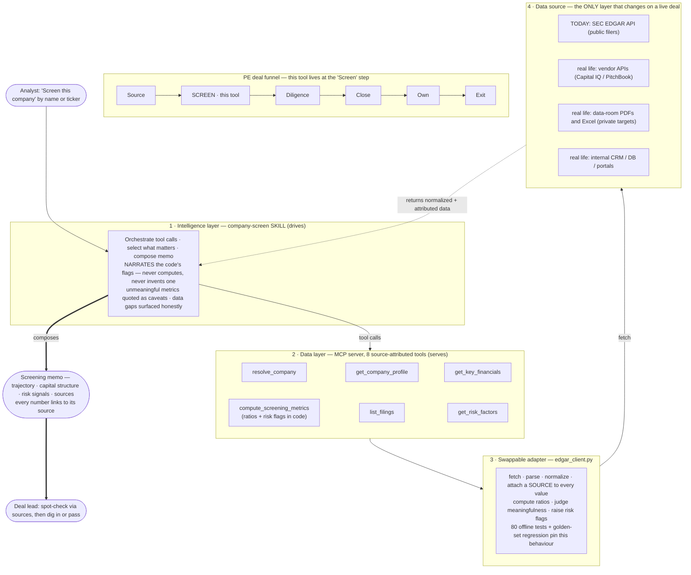

# PRD — Northbridge Screening Assistant

| | |
|---|---|
| **Product** | Northbridge Screening Assistant (SEC EDGAR MCP server + `company-screen` skill) |
| **Author** | Chidrupa Mamunooru — Delivery Engineer |
| **Status** | Draft v1 (MVP built; roadmap proposed) |
| **Date** | July 28, 2026 |
| **Client** | Northbridge Capital Partners — lower-middle-market private equity |

---

## 1. Summary

Northbridge's deal team screens dozens of potential targets and public comparables every quarter. Today an analyst does this by hand — find the filings, pull financials into a spreadsheet, read the risk section, write a short memo — and it is **slow, inconsistent, and often late.**

The Screening Assistant lets an analyst produce a **trustworthy first-pass screening memo on a public company in under a minute, from a single prompt** ("Screen Beyond Meat"). It is delivered as two composable layers: an **MCP server** that turns SEC EDGAR into clean, source-attributed tools, and a **skill** that orchestrates those tools into a standardized memo.

The organizing principle is **trust**, and it is enforced by where the logic lives: every number traces to a source filing; ratios, the judgment of whether a ratio is *meaningful*, and the risk flags are all computed in Python against fixed thresholds; and the model's job is to narrate that output, never to derive it. Two analysts running the same screen get identical flags — a property a prompt cannot have, and the reason this is trustworthy rather than merely fast.

## 2. Problem & context

A PE deal team runs a funnel: *source → screen → diligence → close → own → exit.* Screening is the triage step — deliberately shallow and fast, its whole value is killing weak names quickly so the team spends scarce time only on promising ones. The current manual process fails on three axes:

- **Slow** — hours per name; an analyst can only cover so many.
- **Inconsistent** — quality and coverage swing with whoever did the work; no standard format for the deal lead.
- **Late** — by the time a memo lands, the opportunity has sometimes moved.

And underlying all three: the deal lead must be able to **trust the numbers**. A memo they can't verify — or that an AI might have hallucinated — is worse than useless, because acting on a wrong figure is a real financial error.

> Client statement: *"We want a way to get this data via Claude so our analysts save time, and the deal team is able to trust those numbers."*

## 3. Goals & non-goals

**Goals**
- G1 — Cut time-to-first-screen from hours to **< 2 minutes** of analyst effort.
- G2 — Produce a **consistent, standardized** memo regardless of which analyst runs it.
- G3 — Make every figure **verifiable**: each number links to the exact filing it came from.
- G4 — Surface the **financial trajectory, capital structure, and risk signals** a deal lead needs to decide "dig in or pass."
- G5 — Be **safe on bad/edge inputs** — never fabricate data; degrade to honest gaps.

**Non-goals (v1) — deliberate scope discipline**
- Not an investment recommendation or valuation. This is a *screen*, not diligence or a deal model.
- Not a full valuation/comps engine (roadmap — see §9).
- Not private-company coverage. EDGAR is public filers only (see §10, Constraints).
- Not real-time market/trading data or price feeds.
- Not a UI product — it runs inside the firm's existing Claude client.

## 4. Users

| Persona | Role | Needs from this product |
|---|---|---|
| **Analyst** | Runs the screen | Speed; one command; a memo they can hand up without reformatting; confidence the numbers are right. |
| **Deal lead** | Consumes the memo, decides | A two-minute read; the trajectory + capital structure + risk flags; **traceable numbers** they can spot-check; a clear "worth a look?" signal. |
| **Delivery Engineer (PressW)** | Maintains/extends | Clean tool boundaries, testable logic, a README that onboards them cold. |

## 5. Key user stories

- As an **analyst**, I type "screen {company}" and get a formatted memo in under a minute, so I can cover more names per day.
- As an **analyst**, when I give an ambiguous name ("screen Bank"), the system asks which company I mean instead of guessing wrong.
- As a **deal lead**, I can click any number in the memo through to its source filing, so I can trust it without redoing the work.
- As a **deal lead**, I see the headline risk flags (declining revenue, thin margins, leverage, liquidity, going-concern language) without reading the 10-K myself.
- As a **deal lead**, when data is missing, the memo tells me plainly rather than filling gaps with guesses.

## 6. Requirements

### 6.1 Functional
- **F1 — Company resolution.** Accept a ticker or name; resolve to a CIK; surface ambiguity as candidates rather than guessing.
- **F2 — Company profile.** Identity, SIC industry, fiscal year-end, latest 10-K/10-Q.
- **F3 — Multi-year financials.** Income statement, balance sheet, cash flow from annual 10-K XBRL; absorb cross-filer tag variance via a fallback chain.
- **F4 — Screening metrics.** Growth, margins, leverage, liquidity — **computed in code**, each returning the sourced inputs used and a `meaningful` verdict with a caveat when the ratio is not interpretable (negative, zero, or near-zero denominator).
- **F4b — Risk flags.** A structured, deterministic flag list (`code`, `severity`, `message`, sourced `evidence`) raised in code against a published threshold set that is returned with the response. Covers negative equity, earnings quality, liquidity, leverage, coverage, negative EBITDA, revenue decline, cash burn, plus data-quality flags for stale, discontinued, mixed-basis and restated line items.
- **F5 — Filings & events.** Recent filings with direct EDGAR URLs; surface recent 8-Ks worth a second look.
- **F6 — Risk factors.** Extract Item 1A from the latest 10-K; conservative extraction with a source-URL fallback on failure.
- **F7 — Memo generation.** Standard template covering trajectory, capital structure, risk signals, data gaps, and a sources table, with `[S#]` attribution markers. Optional polished HTML render.

### 6.2 Non-functional
- **N1 — Attribution is structural.** Every datapoint carries `{period, fiscal_year, form, accession, source_url}`. No source → not in the memo.
- **N2 — Trustworthy math and judgment.** Ratios, meaningfulness, and risk flags are computed in Python, never by the model. The skill is instructed that `flags` is authoritative — report every high/medium flag, invent none, suppress none.
- **N3 — Reproducibility.** The same inputs produce byte-identical metrics and flags. Thresholds live in one dict and are returned with every response so the reader sees the bar that fired.
- **N4 — Robustness.** Uniform error envelope; handle 403 (missing SEC header), bad ticker, private/foreign filer, missing tags, messy HTML — each without crashing the turn. Retry with exponential backoff on 429/5xx only.
- **N5 — Fair-access compliance.** Descriptive `User-Agent` required; self-throttle < 10 req/s; a bounded TTL cache. A full screen costs **two** HTTP calls (ticker map + one `companyfacts` blob).
- **N6 — Composability.** All logic in a testable client module; the MCP server is a thin shim; the skill is the only orchestration layer.
- **N7 — Tested behaviour.** An offline suite runs the real code against recorded EDGAR responses, plus a golden-set regression over the full screen output that names the drifted field on failure.
- **N8 — Onboardability.** A README that lets a teammate configure, run, and extend it cold.

## 7. Solution overview

Two layers with a clear driver/servant relationship: **the `company-screen` skill sits on top and orchestrates; the MCP server sits underneath and serves data.** The skill is invoked *first* (on the analyst's prompt) and finishes *last* (composing the memo); the MCP tools run *in between*. Data makes a round trip — the skill calls down, source-attributed data returns up, and the skill composes the memo from it.

*Rendered version: `architecture_flow.png` (slides) · `architecture_flow.html` (self-contained) · editable source `architecture_flow.mmd`.*

**1 · Intelligence layer — the skill (top; drives).** Orchestrates the tool calls in order, decides what leads the memo, and renders the standardized template with inline attribution. It uses tool-computed numbers as-is, narrates the computed flags, honours each metric's `meaningful` verdict, and surfaces gaps honestly. Invoked first (on the prompt) and last (composing the memo).

**2 · Data layer — the MCP server (below; serves).** 7 focused, single-responsibility, non-overlapping tools, one per diligence question: `resolve_company`, `get_company_profile`, `get_key_financials`, `compute_screening_metrics`, `list_filings`, `get_risk_factors`, `get_financial_concept` (escape hatch). Each returns source-attributed data. The tools know nothing about the skill.

**3 · Swappable data adapter (`edgar_client.py`).** All HTTP / parse / normalize logic, the attribution, the ratio math, the meaningfulness verdicts, and the flag engine. On a live engagement this is the *only* layer that changes — swap EDGAR for vendor APIs, data-room PDFs, or internal systems and the tools + skill above are unchanged.

### 7.1 The trust boundary — where the judgment lives

The first working version put the interesting judgment in the skill prompt: *"flag negative equity rather than quoting the exploded ratio," "call out a current ratio below 1."* It produced good memos and it was unfalsifiable. Two runs could disagree, and nobody could point at the line that decided.

So the boundary moved. The rule is **code computes, the model narrates**:

| Decision | Owner | Why |
|---|---|---|
| Which filings and tags a figure comes from | Code | Must be reproducible and auditable. |
| Every ratio | Code | LLM arithmetic is not trustworthy at a deal lead's standard of proof. |
| Whether a ratio is *meaningful* | Code | A negative or near-zero denominator makes a mathematically valid ratio misleading. `_guarded_ratio` returns `(value, meaningful, caveat)`; Beyond Meat's debt/equity of −417.0 comes back marked unmeaningful with an instruction to report the negative equity balance instead. |
| Which risks to flag, and at what threshold | Code | `_detect_flags` returns `code`/`severity`/`message`/sourced `evidence` against one published `THRESHOLDS` dict. Deterministic and diffable. |
| What leads the memo; how it reads | Skill | Judgment about audience and salience is exactly what a language model is for. |
| Qualitative signals in filing text (going concern, covenant waivers, auditor change) | Skill | Code cannot read prose. Reported separately from computed flags, each with its own source. |

### 7.2 What the data layer absorbs so the memo doesn't inherit it

XBRL is messier than its reputation. Four realities are handled in code, each pinned by a test named after the failure it prevents:

**Filers switch tags mid-history.** First-tag-wins truncates a series at the ASC 606 revenue transition — Ford returned 10 years instead of 19. Candidate tags are now *merged per fiscal year* in priority order, and a series spanning more than one tag is marked `mixed_tag_basis`.

**Fiscal years aren't calendar years.** Target's fiscal 2009 ended 2010-01-30; naive labelling puts two "2009"s in the series. The filer's own `fy` label is read out of the facts and carried across to comparatives.

**Filers abandon tags.** Target stopped tagging `GrossProfit` after FY2017. A positional slice would set FY2017 gross profit beside FY2025 revenue and call it a margin. Every series is windowed by fiscal year against a `reference_fiscal_year`, and a discontinued tag becomes a visible gap plus a flag — never a stale number.

**Filers restate.** The policy is explicit (`as_last_reported` by default) and a revised figure carries `restated: true` with `originally_reported`, so the change is auditable rather than invisible.

### 7.3 How the behaviour is held in place

80 tests run the real client against **recorded** EDGAR responses — Beyond Meat for distress, Target for calendar and tag chaos — in under a second with no network. Recorded rather than hand-mocked, because hand-written mocks never invent a January-FYE retailer that abandons `GrossProfit`; real filings do, and those are the cases that break screens.

On top sits a golden-set regression over the entire screen output. When it fails it names the field — `flags lost: ['LIQUIDITY']` — instead of dumping a 200-line dict. It was verified to bite by deliberately moving a threshold and confirming it caught the lost flag.

## 8. Deliverable spec — the screening memo

One screen, deal-lead-readable in ~2 minutes:
1. **Snapshot** — what they do, size, the single most important takeaway.
2. **Screen signal** — Worth a closer look / Neutral / Notable concerns + one-line why.
3. **Financial trajectory** — revenue trend & growth, margins, cash flow + a 3-year table.
4. **Capital structure** — debt, leverage, liquidity.
5. **Risk signals** — computed red flags + salient Item 1A items + recent 8-Ks.
6. **Data gaps & caveats** — anything missing, stated plainly.
7. **Sources** — every filing cited, with accession + URL.

## 9. Success metrics

| Metric | Target | Ties to |
|---|---|---|
| Analyst time per screen | < 2 min (from hours) | G1 (slow) |
| Memo format consistency | 100% (fixed template) | G2 (inconsistent) |
| Numbers with a resolvable source | 100% | G3 (trust) |
| Deal-lead trust (spot-checks pass) | Numbers reconcile to filings | G3 |
| Flag reproducibility across runs | 100% identical (asserted in tests) | G2, G3 |
| HTTP calls per screen | 2 (ticker map + companyfacts) | N5, fair access |
| Graceful handling of bad/edge inputs | No fabricated data; gaps flagged | G5 |
| Screens per analyst per day | Materially higher (leading indicator of funnel throughput) | G1 |

## 10. Scope, phasing & roadmap

**v1 (built).** The eight tools; the code-side ratio, meaningfulness and flag engine; the skill; the memo (Markdown + HTML); structural attribution; error handling and retries; a two-call-per-screen data path; 80 offline tests plus a golden-set regression; README; one live sample (Beyond Meat — demonstrates catching a one-time-gain "profit mirage").

**v2 (next — priority order):**
1. **Comps tool** — auto-assemble a peer set (SIC + size band, human-overridable) with side-by-side metrics. Highest-leverage add for a PE screen, and the prerequisite for industry-relative thresholds.
2. **Widen the golden set** — the harness exists; it needs more filers through it. 15–20 companies (clean large-cap, foreign filer, recent IPO, restated, spin-off) with expected behaviour, run in CI.
3. **Segment & MD&A extraction** — business-mix detail, not just consolidated numbers.
4. **Smarter risk extraction** — structured risk factors with severity + year-over-year diff to surface *newly added* risks.
5. **Disk-backed cache keyed on latest accession** — the in-process TTL cache dies with the process; persisting `companyfacts` makes repeat screens instant across sessions while still catching new filings.

## 11. Constraints, assumptions & open questions

**Constraints**
- **Public filers only.** EDGAR does not cover private companies; lower-middle-market PE mostly buys private ones. In practice the tool is strongest on **public comps** and public targets. On a live engagement, EDGAR would be swapped/augmented with the vendor systems (Capital IQ, PitchBook, data rooms) the firm actually uses — the architecture (thin client + attributed tools + skill) carries over.
- **US-GAAP XBRL.** Foreign private issuers (20-F/IFRS) and non-XBRL filers won't fully populate financials; the tool says so.
- SEC fair-access: descriptive User-Agent + rate limiting required.

**Assumptions**
- Analysts operate inside a Claude client with the MCP server configured.
- Annual (10-K) granularity is sufficient for a first-pass screen; quarterly is a later add.
- "Total debt" approximated from long-term + current debt tags (flagged where material).
- EBITDA is a proxy — operating income plus D&A from the cash flow statement — not any filer's adjusted definition.
- Thresholds are one global set in v1; industry-relative bands wait on the comps tool.

**Open questions**
- Which vendor data source(s) replace/augment EDGAR on live engagements, and what's their auth/rate model?
- Does Northbridge want a fixed memo template, or per-sector variants (e.g. SaaS vs. industrials metrics)?
- Should the "screen signal" be advisory only, or drive a triage queue / CRM handoff?

## 12. Risks

| Risk | Mitigation |
|---|---|
| Model hallucinates a figure | Numbers only from tools; ratios computed in code; no-source-no-number rule. |
| Model invents, softens or omits a risk | `flags` is produced in code and declared authoritative in the skill; every high/medium flag must appear, none may be added. |
| Misleading ratios on distressed names (e.g. negative equity) | The *tool* marks the ratio `meaningful: false` with a caveat naming the negative balance to report instead. Not a prompt instruction — a returned field, covered by a test. |
| Cross-filer tag variance yields wrong/blank metrics | Candidate tags merged per fiscal year; mixed bases flagged; missing metrics flagged, never estimated; golden set guards regressions. |
| Stale figures silently paired across years | Every series windowed by fiscal year against a `reference_fiscal_year`; point-in-time metrics read one exact year; discontinued tags surface as a gap plus a flag. |
| Thresholds drift or get tuned invisibly | Thresholds live in one dict, are returned with every response, and a change that alters a flag fails the golden test by name. |
| EDGAR HTML changes break risk extraction | Conservative extraction degrades to a source link, not a guess. |
| One global threshold set misreads an industry | Stated as a known limitation; industry-relative bands depend on the comps tool (v2 item 1). |
| Public-only coverage disappoints on private targets | Scope stated up front; comps positioned as the primary near-term value; vendor-swap path defined. |
